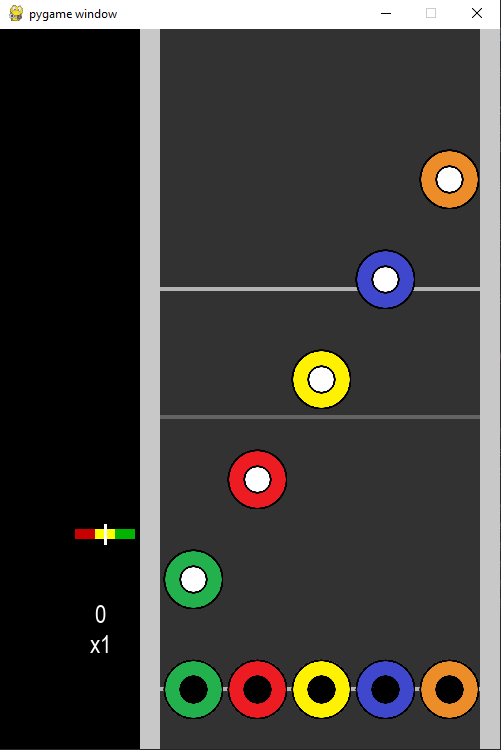

# Gym Hero
This repository contains code used on the experiments of my undergraduate thesis for my B.S in Computer Engineering.

## Description:

We created an Reinforcement Learning Environment based on the rhythm game Guitar Hero. It is composed of a similar rhythm game, developed using the graphics engine PyGame on a 2D perspective, relying on randomly generated music and three difficulty levels. On top of it a Gym Environment was implemented to train and evaluate reinforcement learning agents.

The experiments evaluated a set of 3 autonomous agents trained in this environment using Deep Reinforcement Learning. Each agent was trained on a different level using Deep Q-Learning, a technique that combines Reinforcement Learning with Deep Neural Networks. The input of the network is only the pixels of the screen. 

The agents trained on Easy and Medium levels were capable of learning the expected behaviors to play the game. However, the agent trained on the Expert level could not learn the adequate behavior to beat this level. The obtained results validate the proposed environment as capable of evaluating autonomous agents on reinforcement learning tasks.



## How to run it:
After cloning the repository, enter the project folder and type the following commands on the terminal
```
virtualenv venv --python=python3

source venv/bin/activate

pip install -r requirements.txt
```

When the installation is done, enter the src folder and on the terminal run:
```
python game.py ../charts/<chart-file-name>.chart --difficulty Easy
```
This will execute the human-playable version of the game. To train an agent run:
```
python gymhero_dqn_train.py ../charts/<chart-file-name>.chart --difficulty Easy
```
You can change the difficulty just use Medium or Expert instead of Easy.

## References and helpful links:
- [OpenAI Gym](https://github.com/openai/gym)
- [List of songs to download](https://docs.google.com/spreadsheets/d/13B823ukxdVMocowo1s5XnT3tzciOfruhUVePENKc01o/htmlview?usp=drive_web)
